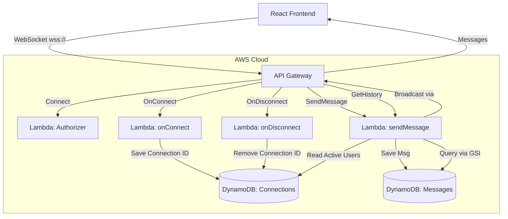

# Building a Real-Time Chat App: Lessons from Cloud Architecture

Over the past few months, I took a class on cloud architecture. As a senior in the cybersecurity program at BYU, we don't always spend a lot of time on pure software engineering or complex cloud architecture, so I was curious how the content I learned in this class would tie into the rest of my curriculum.

For the first few weeks, we went over what felt like a million different AWS acronyms. Knowing when to use one type of compute over another felt very theoretical, and I struggled to have a firm grasp on how to leverage these technologies practically. The final assignment was to create a "cookie-cutter" VPC for a hypothetical business using AWS Academy accounts. While useful, the restrictions meant we couldn't implement many features ourselves.

Fortunately, we were given the option to build our own project of a similar scale. I saw this as an opportunity to finally get hands-on and understand how AWS services actually work together.

## The Goal: Real-Time Communication on a Student Budget

I decided to build a real-time chat application. It felt like a project that was just complicated enough to be impressive, but simple enough to demonstrate effectively.

I had two main constraints:

- **Serverless Architecture**: I didn't want to manage EC2 instances or worry about patching servers.
- **Cost**: It had to be as cheap as possible (ideally free).

AWS offers a generous (to me) free tier, and since I wasn't expecting thousands of users, a serverless approach using Lambda and DynamoDB seemed perfect. The free tier includes:
- **API Gateway**: 1M messages/month free
- **Lambda**: 1M requests + 400K GB-seconds/month free
- **DynamoDB**: 25GB storage + 25 read/write units free

For the frontend, I stuck to my preferred stack of React + Vite.

## The Architecture

Deciding how to architect this was the first big challenge. Real-time communication usually requires a persistent connection between the client and server. In a traditional setup, you might run a Node.js server with Socket.io. But in a serverless world, Lambda functions are ephemeral. They spin up, do a job, and die. They can't hold a WebSocket connection open.

The solution was AWS API Gateway v2 with WebSocket support.



### 1. The Gateway (The "Doorman")

API Gateway acts as the persistent layer. It holds the WebSocket connection with the user. When a user sends a message, API Gateway triggers a Lambda function based on the route selection expression.

The `route_selection_expression = "$request.body.action"` tells API Gateway to route messages based on an `action` field in the JSON body. For example:

```javascript
// Frontend sends: { action: 'sendMessage', message: 'Hello' }
// Frontend sends: { action: 'getHistory' }
// API Gateway routes based on the action field
```

In Terraform, setting this up was surprisingly concise. Instead of clicking through a hundred console menus, I defined the API protocol explicitly:

```terraform
# terraform/api-gateway.tf

resource "aws_apigatewayv2_api" "websocket_api" {
  name                       = "${var.project_name}-websocket"
  protocol_type              = "WEBSOCKET"
  route_selection_expression = "$request.body.action"

  tags = {
    Name        = "${var.project_name}-websocket-api"
    Environment = var.stage_name
  }
}
```

### 2. The Database (DynamoDB)

I needed two tables:

- **Connections Table**: Stores the connectionId of every user currently online.
- **Messages Table**: Stores the chat history.

I used `PAY_PER_REQUEST` billing mode for both tables, which is perfect for unpredictable student project traffic. No need to provision capacity or worry about throttling.

One interesting optimization I learned was using Global Secondary Indexes (GSIs). To load chat history efficiently, I needed to grab the last 50 messages sorted by time. DynamoDB is a key-value store, not a relational database, so "SELECT * ORDER BY time" isn't free.

The trick is using a constant partition key. I set `messageType='chat'` for all messages, which allows me to query all messages sorted by timestamp. The GSI uses `messageType` as the partition key and `timestamp` as the sort key:

```terraform
# terraform/dynamodb.tf

  global_secondary_index {
    name            = "TimestampIndex"
    hash_key        = "messageType"    # Partition key (constant: 'chat')
    range_key       = "timestamp"      # Sort key (allows time-based queries)
    projection_type = "ALL"
  }
```

This pattern lets me efficiently query: "Give me all chat messages sorted by timestamp, limit 50."

### 3. The Logic (Lambda)

The hardest part was the logic for broadcasting messages. Since Lambda doesn't "know" who is connected, it has to:

1. Read all active connectionIds from DynamoDB.
2. Loop through them.
3. Post the message back to API Gateway for each connection.

I also optimized for container reuse by creating AWS SDK clients outside the handler function. Lambda containers can be reused across invocations, so this avoids recreating clients on every request—a small optimization that reduces latency and overhead.

Here is a snippet of the broadcasting logic I wrote in Node.js:

```javascript
// lambda/sendMessage.js

const broadcastMessage = async (apiGatewayClient, connectionsTable, messageData) => {
  // Get all active connections
  const result = await dynamodb.send(new ScanCommand({
    TableName: connectionsTable
  }));

  // Broadcast to all connections
  const broadcastPromises = result.Items.map(async (connection) => {
    try {
      await apiGatewayClient.send(new PostToConnectionCommand({
        ConnectionId: connection.connectionId,
        Data: JSON.stringify(messageData)
      }));
    } catch (error) {
      // If a user disconnected without telling us (410 Gone), clean up the DB
      if (error.statusCode === 410 || error.name === 'GoneException') {
        console.log(`Removing stale connection: ${connection.connectionId}`);
        await dynamodb.send(new DeleteCommand({
          TableName: connectionsTable,
          Key: { connectionId: connection.connectionId }
        }));
      }
    }
  });
  
  await Promise.all(broadcastPromises);
};
```

Error handling was crucial. I also implemented:
- Message length validation (1000 character limit)
- Handling of malformed JSON
- Fallback to Scan if GSI query fails

### 4. Message History (The getHistory Route)

A major feature I initially overlooked was loading chat history when users connect. The `getHistory` route uses the same `sendMessage` Lambda function but handles a different action. When triggered, it:

- Uses the GSI to efficiently fetch the last 50 messages
- Automatically loads when users first connect
- Returns messages sorted by timestamp (newest first)

This route is triggered when the frontend sends `{ action: 'getHistory' }`. The Lambda queries the Messages table using the GSI with `messageType='chat'` and sorts by timestamp, then returns the results to the client. Without this, users would only see messages sent after they joined—not ideal for a chat app.

### 5. Security: The Authorizer

Security was a critical consideration. I implemented server-side validation in both the authorizer and `onConnect` Lambda (defense in depth):

- **Username validation**: 2-20 characters, alphanumeric plus spaces/hyphens/underscores
- **XSS pattern detection**: Blocks `<script>`, `javascript:`, and other injection patterns
- **Query string validation**: The authorizer validates usernames from query strings before connections are established, preventing malicious usernames from even reaching the connection handler

The authorizer runs before any connection is established, so invalid usernames are rejected at the gateway level.

## Infrastructure as Code: Why Terraform?

I wanted to use this project to learn Terraform, and it turned out to be the best decision I made.

In the AWS Console, if you delete a Lambda function by mistake, you have to remember exactly how you configured the permissions, the environment variables, and the triggers. With Terraform, I just ran `terraform apply` and my entire infrastructure, database, permissions (IAM), API routes, and functions, was rebuilt in minutes.

An obstacle that came up that I was not expecting was how to manage Terraform state across devices. I use a different computer at home than when I am at school, which quickly led to issues with tracking the state when switching devices.

What I came up with was using an S3 bucket as a remote state. I also created a DynamoDB table that would track if someone was actively making changes and apply a state lock. It might not be the most relevant thing for a solo developer, but it was simple enough to implement and felt like the "correct" way to engineer it.

```terraform
# terraform/backend.tf
# Note: Bucket name is an example - use your own unique bucket name

terraform {
  backend "s3" {
    bucket         = "your-terraform-state-bucket"
    key            = "chat-app/terraform.tfstate"
    region         = "us-east-1"
    dynamodb_table = "terraform-state-lock" # Handles the locking
    encrypt        = true
  }
}
```

### IAM Permissions: The Hidden Complexity

Getting components to talk to each other requires very specific IAM permissions. Here's a brief example of what the Lambda functions need:

```terraform
# Example IAM policy for sendMessage Lambda
# Note: In production, use specific ARNs instead of wildcards where possible
{
  "Effect": "Allow",
  "Action": [
    "dynamodb:PutItem",
    "dynamodb:GetItem",
    "dynamodb:DeleteItem",
    "dynamodb:Scan",
    "dynamodb:Query",
    "execute-api:ManageConnections"
  ],
  "Resource": [
    "arn:aws:dynamodb:us-east-1:123456789012:table/Connections",
    "arn:aws:dynamodb:us-east-1:123456789012:table/Messages",
    "arn:aws:execute-api:us-east-1:123456789012:*/@connections/*"
  ]
}
```

Each Lambda needs explicit permissions for every AWS service it touches, and the resource ARNs must be precise (not wildcards where possible for security).

## The Frontend: Balancing Design and Development Speed

I admit, I am a sucker for frontend design. Even though this was a cloud architecture project, I wanted it to look good—but I also didn't want to spend days tweaking CSS when the real learning was in the backend architecture.

This is where AI tools like Cursor, V0, and Figma AI became force multipliers for a solo developer:

- **Design exploration**: I used V0 to generate a "warm minimalism" UI based on Radix UI components. Instead of starting from a blank canvas, I could iterate on something that already looked professional.
- **Infrastructure boilerplate**: Writing Terraform IAM policies is tedious and error-prone. I'd prompt Cursor with "Give me a Terraform policy that allows this Lambda to write to this specific DynamoDB table," turning 20 minutes of documentation hunting into 30 seconds of code review.


This experience taught me something valuable: AI tools are best used for generating boilerplate and exploring design options, not for understanding complex system interactions. I still needed to deeply understand WebSocket lifecycles, DynamoDB access patterns, and IAM permissions to debug when things went wrong.

## Building a Robust WebSocket Connection: The Frontend's Role in a Serverless Architecture

While I spent most of my time architecting the backend, I quickly realized the frontend needed to be just as sophisticated. In a traditional server setup with Socket.io, the server handles much of the connection lifecycle. In a serverless world, the frontend carries more responsibility.

### The Reconnection Challenge: When Lambda Functions Come and Go

WebSocket connections can drop—users close their laptops, switch networks, or Lambda cold starts cause temporary delays. Unlike a traditional Node.js server that maintains long-lived connections, API Gateway needs the client to be resilient.

I implemented automatic reconnection with exponential backoff: wait 3 seconds after the first failure, then 6, then 12, up to a maximum of 5 attempts.

```javascript
// Exponential backoff: 3s, 6s, 12s, 24s, 48s
const delay = reconnectInterval * Math.pow(2, reconnectCountRef.current - 1)
```

But there's a React-specific gotcha: WebSocket event handlers can capture stale state if you're not careful. I used `useRef` to store the WebSocket instance and callback functions, ensuring handlers always have fresh data—a pattern I had to learn the hard way after messages started duplicating.

### State Management: The Frontend as the "Memory"

Remember how Lambda functions are stateless? The frontend needs to maintain its own state too. When a username changes, the WebSocket must reconnect with new credentials. But React's `useEffect` can fire multiple times during renders, so I had to carefully clean up old connections before creating new ones.

This was a good reminder: serverless doesn't mean stateless everywhere, you're just moving where that state lives.

### Message Validation & Error Handling

The frontend validates every message it receives. Just because it came over the WebSocket doesn't mean it's trustworthy. Each message must have a valid timestamp, username, and message content. Invalid messages are silently filtered out rather than crashing the UI.

```javascript
// Validate message before adding to state
if (!message.timestamp || !message.username || !message.message) {
  console.warn('Received invalid message format:', message)
  return // Skip this message
}
```

### Automatic History Loading

When a user connects, the frontend automatically requests the last 50 messages from the server. This happens immediately after the WebSocket connection opens, before the user even types anything. The Lambda function uses that DynamoDB GSI we discussed earlier to efficiently fetch recent messages sorted by timestamp.

### Connection Status UX

The UI shows real-time connection status: connecting, connected, disconnected, or error. This transparency was crucial during development—seeing "error" immediately told me if my backend deployment failed. In production, it helps users understand when they've lost connectivity.

The frontend turned out to be more complex than I expected. Managing WebSocket lifecycle, handling reconnections, validating data, and providing good UX feedback required more state management logic than a simple chat interface might suggest. 

## The Missing Features You Don't Think About

When building a real-time chat app, there are several features that seem obvious in hindsight but aren't immediately apparent:

- **Message history loading**: Users expect to see previous messages when they join. The `getHistory` route and GSI pattern make this efficient.
- **Stale connection cleanup**: Users can disconnect without properly closing the WebSocket (closed browser, network issues). Handling 410 Gone errors and cleaning up the database prevents memory leaks.
- **Server-side username validation**: Never trust the client. The authorizer validates usernames before connections are established, preventing XSS and injection attacks.
- **Route-based message routing**: Using the `action` field in the message body allows a single WebSocket connection to handle multiple types of operations (sendMessage, getHistory, etc.).

## What I Learned

Building this app bridged the gap between the "million acronyms" I learned in class and actual engineering.

- **State is hard in Serverless**: You take for granted that a server knows who is connected. In Lambda, you have to build that "memory" yourself using a database.
- **Testing WebSocket Lambda functions is challenging**: You can't easily test WebSocket connections locally. I had to deploy to AWS to test, which slowed down the development cycle. I created test scripts using event payloads to simulate API Gateway invocations, but they still required the full infrastructure to be running.
- **Modern Dev Tools**: Combining Terraform for the backend and AI-assisted coding for the frontend allowed me to build a project that would have taken a team of three a few weeks to build in just a fraction of the time.
